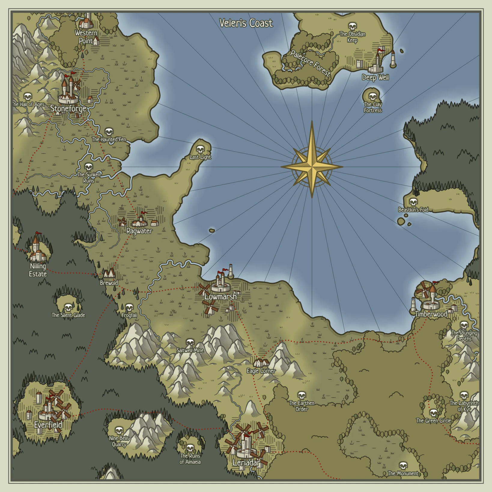

Veleris Coast has been slowly devoured by wastelands for a generation. Some say it's a horrible curse, others believe it's just natural shifting, and a few still cling to the hope that the wastes will recede and the lush farmland will return.

Those living in the Southern forests have not worried as much up to now, but as more farmland becomes swallowed up, everyone has started tightening their belts.

With this, an exodus has started. Many people, especially those with money, have headed north through Western Point to the lands farther up the coast. Those who remain in the towns have found themselves in a region with far fewer protections and comforts.

Those who come to the coast now are either running from something, or seeking the kind of adventure that most try to avoid.

### Settlements
[Brewold](Brewold.md)
[Everfield](Everfield.md)
[Ragwater](Ragwater.md)
### Dungeons
